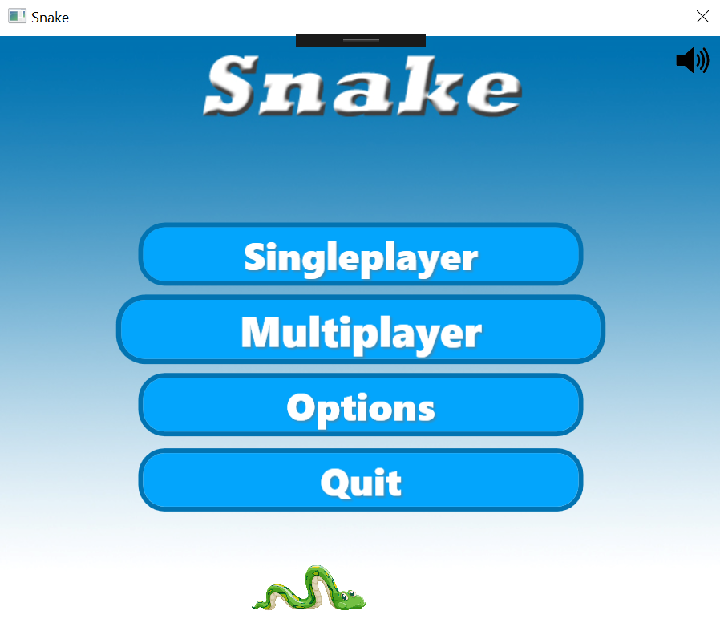
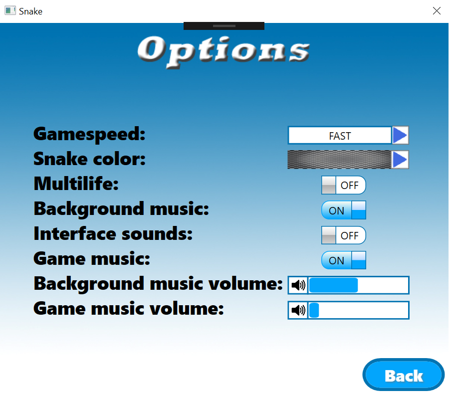
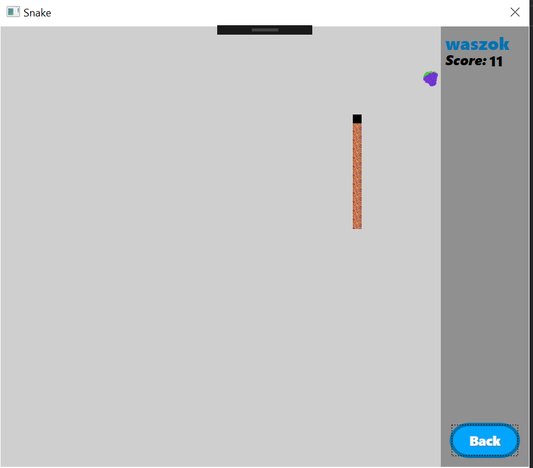
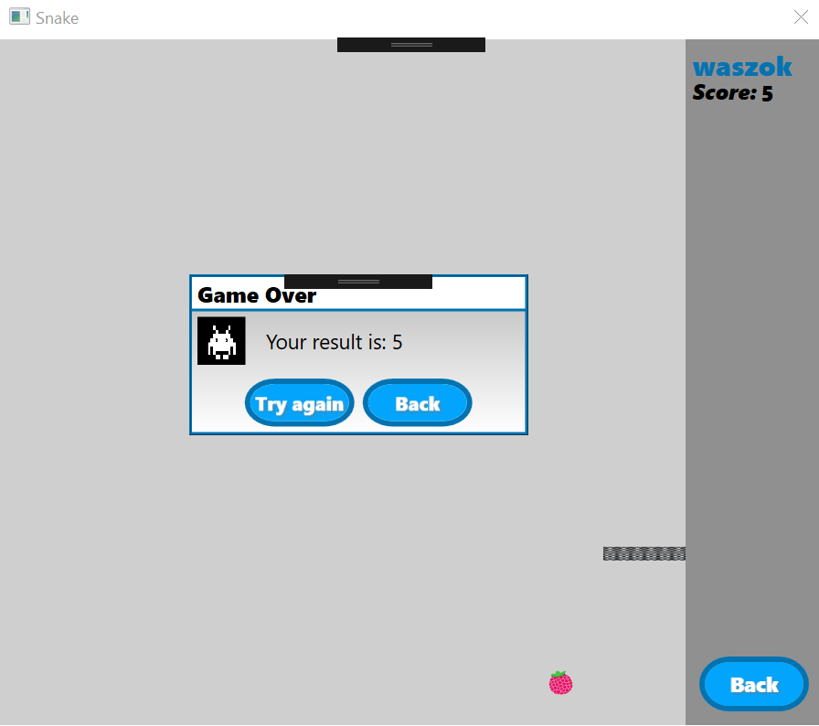

# SnakeGame

Multiplayer Snake Game (for two players). 
Client communicates with a server using sockets, TCP protocol.
GUI is created in WPF.

## Some screenshots:

|  |  |
| ----------------------------------------- | --------------------------------------- |

|  |  |
| ----------------------------------------- | --------------------------------------- |
